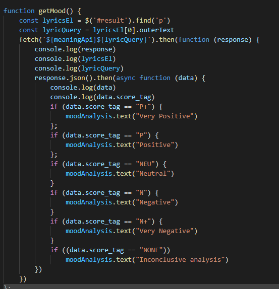

# EzVibez

## Table of contents

- [Technologies](#Technologies)
- [Deployment](#Deployment)
- [Code Overview](#Code-Overview)
- [Summary](#Summary)
- [CSS style](#CSS-style)

## Technologies

Project is created with:

- [Foundation](https://get.foundation/)
- [JavaScript](https://www.javascript.com/)
- [Tastedive](https://tastedive.com/)
- [MeaningCloud](https://www.meaningcloud.com/)
- [lyrics.ovh](https://lyrics.ovh/)
- [particles.js](https://github.com/VincentGarreau/particles.js/)
- [JQuery](https://jquery.com/)
- [w3schools](https://www.w3schools.com/)

## Deployment

Landing page 

https://ghmurphy2.github.io/EzVibez/

## Code Overview

- EzVibez was built with Foundation, Particle js, Lyrics.ovh , Tastedive, and Meaningcloud. Our site queries multiple apis in order to deliver lyrics and a polarity analysis for them. Our users will be able to view the lyrics on a dynamic and fun website which will offer artist recommendations and a search history saved in lcoal storage. The site is populated through Javascript to display lyrics in their entirety with a mood analysis. 

CODE HIGHLIGHTS

ADD GIFS AND IMAGES 

Meaning cloud API Code snippets

Function to pull text polarity

## Summary

- EzVibez is an app that allows users to vizualize song lyrics and there analyized sentiment. It also feature interactive effects that mimic the mood of the song and a list of suggested songs based on the Tastedive Api. 

About API's

- Lyrics.ovh API
    - Lyrics.ovh is a simple lyrics retrieving API. Lyrics.ovh has only two parameters (Artist and Song title). 
    - Lyrics.ovh is a JSON format response. 
    - Lyrics has two errors 200 and 404
ADD IMAGES 

- Meaning cloud API
    - Requires long text strings in API call
    - Slow returns but multiple functions
    - 6 levels of sentiment analysis

    ADD IMAGES

- TasteDive API
    - The TasteDive API can be used to integrate recommendations in other products.
    - An entertainment recommendation engine for films, TV shows, music, video games, and books.
    - Parameters 
    ADD AN IMAGE

## CSS style

- Our project uses a prebuild foundation from to establish our base style and is adapted to our desired wireframe. Particles JS supplies a styled moving canvas behind the lyrics for our users to enjoy. 
- Like Bootstrap, Foundation by ZURB is a responsive front-end framework. It provides a responsive grid system, HTML and CSS UI components, templates, code snippets, and even JS Utilities
- Foundation is Mobile Responsive breakpoints 

ADD AN IMAGE AND GIF 

## Authors

- Gabriel Lantin
- Umera Malek
- Gavin Murphy

## License

- Open Source
