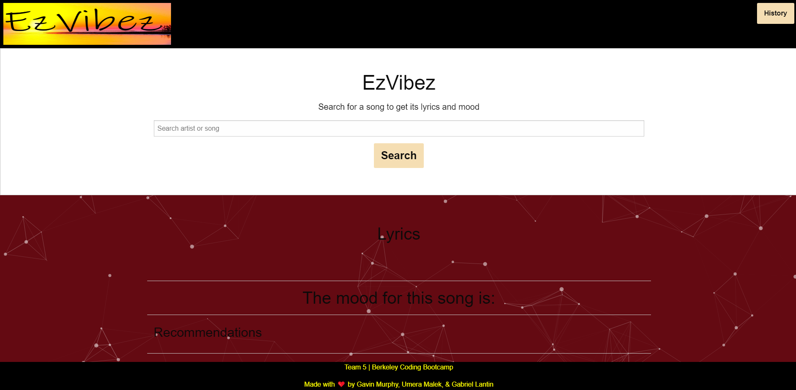
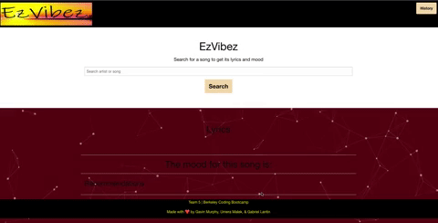
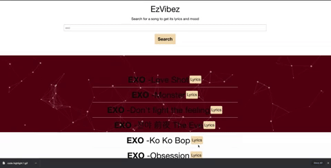
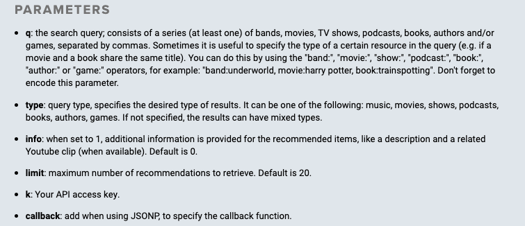
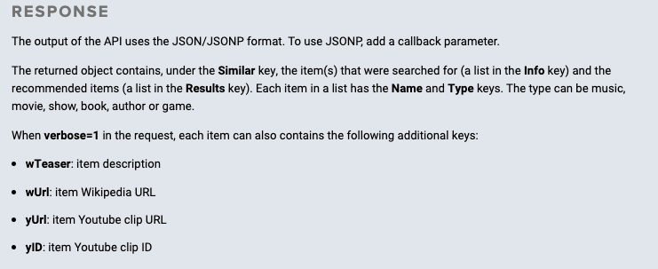

# EzVibez

## Table of contents

- [Technologies](#Technologies)
- [Deployment](#Deployment)
- [Code Overview](#Code-Overview)
- [Summary](#Summary)
- [CSS style](#CSS-style)

## Technologies

Project is created with:

- [Foundation](https://get.foundation/)
- [JavaScript](https://www.javascript.com/)
- [Tastedive](https://tastedive.com/)
- [MeaningCloud](https://www.meaningcloud.com/)
- [lyrics.ovh](https://lyrics.ovh/)
- [particles.js](https://github.com/VincentGarreau/particles.js/)
- [JQuery](https://jquery.com/)
- [w3schools](https://www.w3schools.com/)


## Deployment

Landing page 



https://ghmurphy2.github.io/EzVibez/

## Code Overview

- EzVibez was built with Foundation, Particle js, Lyrics.ovh , Tastedive, and Meaningcloud. Our site queries multiple apis in order to deliver lyrics and a polarity analysis for them. Our users will be able to view the lyrics on a dynamic and fun website which will offer artist recommendations and a search history saved in lcoal storage. The site is populated through Javascript to display lyrics in their entirety with a mood analysis. 

### CODE HIGHLIGHTS

#### Lyrics.ovh

```
async function beginSearch(searchValue) {
    recommended.empty();
    // fetch the results using the api URL 
    const searchResult = await fetch(`${apiURL}/suggest/${searchValue}`);
    // we are suppose to get the data from API in json format
    const data = await searchResult.json();
    // console.log(data);
    
    displayData(data);
}
```
```
function displayData(data) {
    // create HTML in js
    // create the result as a list 
    // .map to create a new array 
    // we are getting the results and the result is the song, artist name and song title 
    // create a button get lyrics to expand to get lyrics
    result.innerHTML = `
    <ul class="songs">
      ${data.data
            .map(song => `<li>
                    <div>
                        <strong>${song.artist.name}</strong> -${song.title} 
                    </div>
                    <span data-artist="${song.artist.name}" data-songtitle="${song.title}">Lyrics</span>
                </li>`
            )
            // to join as a whole string
            .join('')}
    </ul>
  `;
}
```
```
//event listener to get the lyrics button
result.addEventListener('click', e => {
    // create a variable called clicked element
    const clickedElement = e.target;

    //checking if lyrics is a button or not
    if (clickedElement.tagName === 'SPAN') {
        const artist = clickedElement.getAttribute('data-artist');
        const songTitle = clickedElement.getAttribute('data-songtitle');

        // calling upon a function with two parameters
        getLyrics(artist, songTitle)
    }
})
```
```
// Get lyrics for the song
async function getLyrics(artist, songTitle) {
    recommended.empty();
    // fetch something from the API, artist and song title
    const response = await fetch(`${apiURL}/v1/${artist}/${songTitle}`);
    // again needs to be in json format
    const data = await response.json();

    // (/(\r\n|\r|\n)/g, '<br>') got this from the website
    const lyrics = data.lyrics.replace(/(\r\n|\r|\n)/g, '<br>');

    // display lyrics to the 
    result.innerHTML = `<h2><strong>${artist}</strong> - ${songTitle}</h2>
    <p>${lyrics}</p>`;

    getRecommendations(artist);
    getMood();
}
```

  




#### TasteDive 

```
// Populate recommendation section
var getRecommendations = function (search) {
    var key = "425157-EzVibez-ON3O5RLK"; // our tastedive api key
    var url = "https://tastedive.com/api/similar"; // base url
    $.ajax({
        type: "GET",
        data: {
            k: key,
            q: search,
            type: "music"
        },
        url: url,
        dataType: "jsonp",
        // jsonpCallback: 'jsonp_callback',
        // contentType: 'application/json'
    }).then(function (res) {
        // console.log("results", res.Similar.Results[0].Name);
        recommended.append('<h4>Check out these similar artists!</h4>');
        recommended.empty();
        console.log("res", res)
        // Gets the first 8 artists and appends them to the recs section. Each generated button has an event listener
        // to conduct a new search
        for (let i = 0; i < 8; i++) {
            var rec = $("<button></button>").addClass("column").text(res.Similar.Results[i].Name).css("padding", "5px");
            rec.on('click', function() {
                    var artist = $(this).text();
                    // console.log(artist, typeof(artist));
                    beginSearch(artist);
            });
            recommended.append(rec);
        }
    });
}
```

#### Meaning cloud API Code snippets  

Function to pull text polarity
```
function getMood() {
    const lyricsEl = $('#result').find('p')
    const lyricQuery = lyricsEl[0].outerText
    fetch(`${meaningApi}${lyricQuery}`).then(function (response) {
        console.log(response)
        console.log(lyricsEl)
        console.log(lyricQuery)
        response.json().then(async function (data) {
            console.log(data)
            console.log(data.score_tag)
            if (data.score_tag == "P+") {
                moodAnalysis.text("Very Positive")
            };
            if (data.score_tag == "P") {
                moodAnalysis.text("Positive")
            };
            if (data.score_tag == "NEU") {
                moodAnalysis.text("Neutral")
            }
            if (data.score_tag == "N") {
                moodAnalysis.text("Negative")
            }
            if (data.score_tag == "N+") {
                moodAnalysis.text("Very Negative")
            }
            if ((data.score_tag == "NONE"))
                moodAnalysis.text("Inconclusive analysis")
        })
    })
};
```


## Summary

- EzVibez is an app that allows users to vizualize song lyrics and there analyized sentiment. It also feature interactive effects that mimic the mood of the song and a list of suggested songs based on the Tastedive Api. Our app features several user stories: a user wanting to see the lyrics of a song, a user wanting to know the general mood of a song, a user wanting to save their search history, and a user wanting to be presented with similar songs/artists.

About API's

- Lyrics.ovh API
    - Lyrics.ovh is a simple lyrics retrieving API. Lyrics.ovh has only two parameters (Artist and Song title). 
    - Lyrics.ovh is a JSON format response. 
    - Lyrics has two errors 200 and 404


- Meaning cloud API
    - Requires long text strings in API call
    - Slow returns but multiple functions
    - 6 levels of sentiment analysis

   

- TasteDive API
    - The TasteDive API can be used to integrate recommendations in other products.
    - An entertainment recommendation engine for films, TV shows, music, video games, and books.
    - Parameters 
    
    
    


## CSS style

- Our project uses a prebuild foundation from to establish our base style and is adapted to our desired wireframe. Particles JS supplies a styled moving canvas behind the lyrics for our users to enjoy. 
- Like Bootstrap, Foundation by ZURB is a responsive front-end framework. It provides a responsive grid system, HTML and CSS UI components, templates, code snippets, and even JS Utilities
- Foundation is Mobile Responsive breakpoints 
 


## Authors

First Header  | Second Header
------------- | -------------
Gabriel Lantin  | (https://github.com/mushymane)
Umera Malek  | (https://github.com/umeramalek)
Gavin Murphy  | (https://github.com/ghmurphy2)

## License

- Open Source
